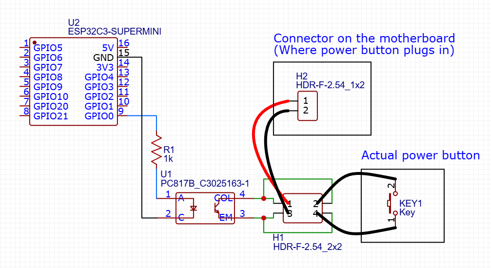

# Powerbutton ESP32 Telegram Bot

Simplest Telegram bot based on Gyver's FastBot2 library. It runs on ESP32 (in my case it's ESP32 C3 Super mini) and shorts out pins of the power button connector of the motherboard.

# Software

The core configuration is defined by "include/env.h" file. There is no such file by default because it is highly recomended to never push is on any public repository and hide it with any means. One must create their on file from template called "include/env.h.default". Just copy it, then rename it, and paste your configuration parameters according to this table:

| Parameter | Where to get it | Example |
| -| - | - |
| WIFI_SSID | The name of your Wi-Fi network (irc it could be even hidden network) | SomePublicWifiName |
| WIFI_PASS | The password for your network (could be empty if it's empty indeed) | \*\*\*\*\*\*\*\*|
| BOT_TOKEN | Use [this bot (BotFather)](https://t.me/BotFather) to get your token | 2143123421:NahIDontGiveYouOne|
| ADMIN_CHAT_ID | Your chat id, used to get few notifications from device. I suggest you get it texting [this bot (userinfobot)](https://t.me/userinfobot) | 123123123 |

Once you built the project and flashed the device, built the hardware part, you can write "/start" to your bot (you entered it's name chatting with BotFather when you were creating a bot). And if it replies (sometimes it takes some time) - that means everything is setup correctly.

When you done with the setup, you finally can work with the device you created.
This bot knows few command you can use (they are doubled as menu buttons):

| Command | 

# Hardware

The optocoupler controlled by ESP32 pin shorts out powerbutton pins on the MB connector. 
MB pins connected via DuPont's (2.54mm cables) to optocoupler, as well as powerbutton cable.
So, when button is pressed, it shorts out pins on the MB. And when the optocoupler is triggered it does the same.

I power the device with USB on the MB that remains power even when PC is powered off.