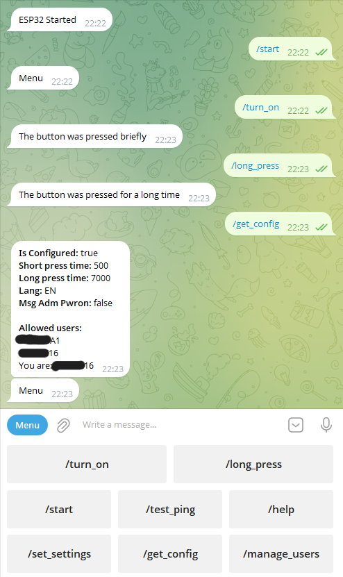

# Powerbutton ESP32 Telegram Bot

A simple Telegram bot to turn on your PC remotely, powered by an ESP32 and the FastBot2 library by AlexGyver. It shorts the power button pins on your motherboard's front panel connector using an optocoupler. This project aims to provide:

- Open-source code with a permissive license
- Clear hardware schematics and instructions for hobbyists
- A convenient and customizable user interface
- Multi-language support (easily extendable)
- Security via an allowlist of authorized users
- Documented user experience

[Russian version is here](README.ru.MD)

## Software

### Configuration

Core settings are defined in `include/env.h`. This file is **not** included in the repository for security reasons (it contains Wi-Fi credentials and your bot token). You must create your own `env.h` from the template `include/env.h.default`:

1. Copy `include/env.h.default` and rename it to `include/env.h`.
2. Fill in the parameters as described below:

| Parameter       | Where to get it                                                                                                 | Example                                     |
| --------------- | --------------------------------------------------------------------------------------------------------------- | ------------------------------------------- |
| `WIFI_SSID`     | The name of your Wi-Fi network (hidden networks also work).                                                     | `MyHomeWiFi`                                |
| `WIFI_PASS`     | Your Wi-Fi password (can be empty if the network is open).                                                      | `secret123`                                 |
| `BOT_TOKEN`     | Get a token from [@BotFather](https://t.me/BotFather) when you create your bot.                                 | `123456:ABC-DEF1234ghIkl-zyx57W2v1u123ew11` |
| `ADMIN_CHAT_ID` | Your personal chat ID (used for important notifications). Get it from [@userinfobot](https://t.me/userinfobot). | `123456789`                                 |

### Building and Flashing with PlatformIO

This project is developed using **Visual Studio Code** with the **PlatformIO** extension. To build and flash the firmware:

1. Install [Visual Studio Code](https://code.visualstudio.com/) and the [PlatformIO IDE extension](https://platformio.org/install/ide?install=vscode).
2. Clone or download this repository and open the project folder in VS Code.
3. Ensure your `env.h` file is properly configured (see above).
4. Connect your ESP32 board via USB.
5. Click the **PlatformIO: Upload** icon in the left sidebar.
6. Send `/start` to your bot (the username you chose with BotFather). If the bot replies (it may take a few seconds), everything is set up correctly.

### Commands

The bot understands the following commands. They are also available as buttons in the reply keyboard for convenience. Users without access can only use `/start`, `/help`, and `/request_access`. The bot menu (left of the input field) always contains links to the main commands.

| Command                 | Description                                                                                                                                |
| ----------------------- | ------------------------------------------------------------------------------------------------------------------------------------------ |
| `/start`                | Show the main menu with buttons.                                                                                                           |
| `/help`                 | Display help information.                                                                                                                  |
| `/turn_on`              | Simulate a short press of the power button – toggles the PC on/off.                                                                        |
| `/long_press`           | Simulate a long press of the power button – forces the PC to shut down.                                                                    |
| `/test_ping`            | Check if the bot is responsive and measure response time.                                                                                  |
| `/get_config`           | Show current bot settings.                                                                                                                 |
| `/set_settings`         | Open the settings menu.                                                                                                                    |
| `/set_lang`             | Change the language. Choose from the menu or type one of: `EN`, `RU`.                                                                      |
| `/set_short_press_time` | Set the duration (in ms) for a short press. The bot will show the allowed range and wait for your numeric input.                           |
| `/set_long_press_time`  | Set the duration (in ms) for a long press. The bot will show the allowed range and wait for your numeric input.                            |
| `/msg_adm_pwron`        | Toggle whether the admin is notified when another user presses the power button. Choose `true` or `false` from the menu or type the value. |
| `/manage_users`         | Open the user management menu.                                                                                                             |
| `/request_access`       | Request access to use the bot (for users not yet authorized).                                                                              |
| `/clear_wait_list`      | Clear the list of users waiting for approval.                                                                                              |
| `/revoke_access`        | Revoke access for a user. Select the user code from the menu or type it directly.                                                            |
| `/give_access`          | Grant access to a user from the waiting list. Select the user code from the menu or type it directly.                                        |
| `BACK`                  | Return to the main menu (same as `/start`).                                                                                                |

### Advanced Configuration

Some parameters can only be changed in the code, in `include/const/config.h`:

| Parameter                                        | Description                                                             |
| ------------------------------------------------ | ----------------------------------------------------------------------- |
| `LONG_PRESS_TIME_DEFAULT`                        | Default duration for a long press (ms).                                 |
| `LONG_PRESS_TIME_MIN`                            | Minimum allowed long press duration (ms).                               |
| `LONG_PRESS_TIME_MAX`                            | Maximum allowed long press duration (ms).                               |
| `SHORT_PRESS_TIME_DEFAULT`                       | Default duration for a short press (ms).                                |
| `SHORT_PRESS_TIME_MIN`                           | Minimum allowed short press duration (ms).                              |
| `SHORT_PRESS_TIME_MAX`                           | Maximum allowed short press duration (ms).                              |
| `LANG_DEFAULT`                                   | Default language (defined in `include/const/translate.h`).              |
| `MAX_USERS_ALLOWED_TO_CONTROL`                   | Maximum number of authorized users.                                     |
| `MAX_USERS_IN_WAIT_LIST`                         | Maximum number of users in the access request queue.                    |
| `SEND_ADMIN_MSG_ON_OTHER_USERS_POWER_ON_DEFAULT` | Whether to notify the admin when another user presses the power button. |

Additionally, this file contains paths to property fields used by the `Properties` library – useful if you want to add more settings or embed this app into another project.

## Hardware

An optocoupler controlled by an ESP32 shorts the power button pins on the motherboard's front panel connector.  
The motherboard pins are connected to the optocoupler via DuPont (2.54mm) cables, as are the physical power button wires.  
Thus, when you press the physical button, it shorts the pins, and when the optocoupler is triggered, it does the same.

I power the ESP32 through a USB port on the motherboard that stays active even when the PC is off.

## Troubleshooting

### Software

- Double-check that the Wi-Fi SSID, password, and bot token are correct in `env.h`. After changing them, re-flash the ESP32.
- If you have no access to the bot, verify that the admin chat ID is correct (a numeric string).

### Hardware

- If everything seems wired correctly but doesn't work, re-check the polarity of the wires from the motherboard. They must be connected exactly as shown in the schematic.